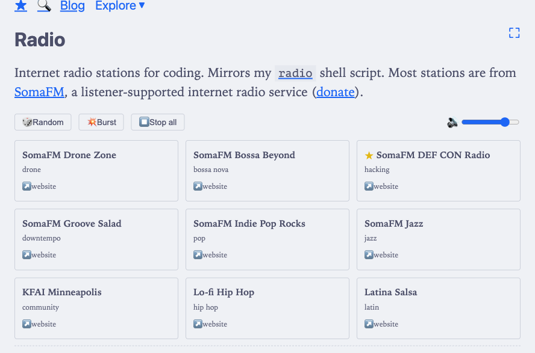

I have a [`radio`](https://github.com/thiagowfx/pancake/tree/master/radio) shell
script in [pancake](https://github.com/thiagowfx/pancake) (=miscellaneous unix
scripts) that streams curated (and free) internet radio stations via `mpv`. It
works great from the [terminal](), but I wanted to
go one step further and make it available from a web browser as well.

The script supports:

- playing a specific station,
- picking a random one,
- burst mode (multiple simultaneous streams), and
- listing what's currently running

All of these map well to a web browser UI.

Fast-forward... (pun intended)

## Gimme radio

I added a [`/radio/`]() page to this blog. It's a single Hugo
layout with inline CSS and JS, following the same pattern as the [graph]() page[^1].

[^1]: Is this the future? Various little web apps in this site?

The core is simple (and effective!) — a (hash) `Map` of station IDs to `Audio`
objects:

```javascript
const playing = new Map();

function play(id) {
  if (playing.has(id)) return;
  const s = getStation(id);
  const audio = new Audio(s.url);
  audio.volume = volume;
  audio.play().catch((e) => {
    console.warn('Failed to play ' + s.name + ':', e.message);
  });
  playing.set(id, audio);
  updateUI();
}

function stop(id) {
  const audio = playing.get(id);
  if (!audio) return;
  audio.pause();
  audio.src = '';
  playing.delete(id);
  updateUI();
}
```

Setting `audio.src = ''` after pausing is important — without it, the browser
keeps the HTTPS connection open to the stream server.

## Burst mode

The shell script has a `--burst` flag that launches `N` random stations
simultaneously. The browser version does the same (well, it's hard-coded to 3
stations):

```javascript
function playBurst() {
  stopAll();
  const indices = [];
  while (indices.length < 3 && indices.length < stations.length) {
    const idx = Math.floor(Math.random() * stations.length);
    if (indices.indexOf(idx) === -1) indices.push(idx);
  }
  indices.forEach((i) => play(stations[i].id));
}
```

Multiple `Audio` objects play concurrently with no issues. The volume slider
applies to all of them.

## Stations

Most stations are from [SomaFM](https://somafm.com/), a listener-supported
internet radio service. They have a [clear policy](https://somafm.com/linktous/)
for third-party players: display the station name and link back. Each card links
    to its station homepage.

I dropped two stations from the original script:

- HBR1 Trance and a rain sounds stream from TorontoCast. HBR1 only serves over
  `http://`, which browsers block as mixed content on HTTPS sites.
- TorontoCast's terms explicitly prohibit embedding streams in third-party
  players.

## Implementation

The UI is a CSS grid of clickable cards with a controls bar (Random, Burst, Stop
All, volume). Playing stations get a highlighted border and a pulsing dot
indicator that respects `prefers-reduced-motion`. The whole thing uses the
blog's existing CSS variables so it works in both light and dark mode,
integrating awesomely with its catppuccin theme.

The page: [`/radio/`]().

And here's a screenshot (light theme)[^2]:



Why is this post tagged with [ai]()? The radio page
was vibe-coded.

Suggestions to add more web radios to that page will be welcome.

[^2]: Taken with [playwright](https://playwright.dev/) via Claude Code. How
    cool!

