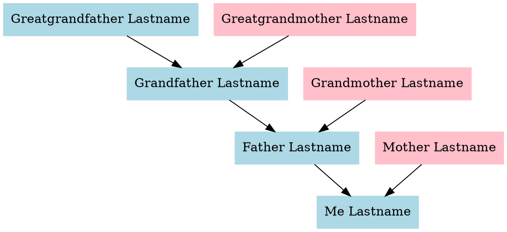
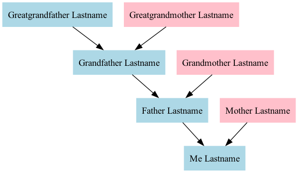

[Graphviz](https://graphviz.org/)...

> is open source graph visualization software. Graph visualization is a way of
> representing structural information as diagrams of abstract graphs and
> networks.

We can also use it to craft family trees!

<!--more-->

I came up with the following template:



...save this to a `tree.dot` file.

A `.png` representation of the graph can then be generated with the following
command:

```shell
dot -Tpng tree.dot > tree.png
```

Note that `dot` is part of the graphviz distribution.

In case it's not installed on your system, it's [widely
available](https://repology.org/project/graphviz/versions), just do it. For
example, on macOS:

```shell
brew install graphviz
```

The final result:


