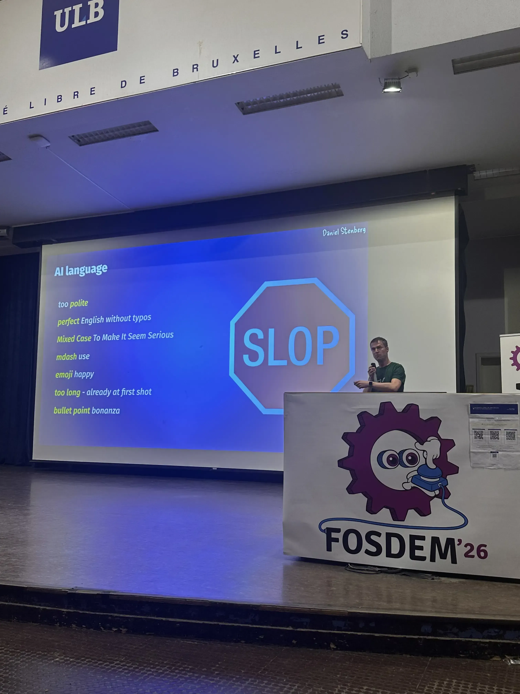

[Open Source security in spite of
AI](https://daniel.haxx.se/blog/2026/02/03/open-source-security-in-spite-of-ai/)
by [Daniel Stenberg](https://daniel.haxx.se/blog/)[^1] (of _curl_ fame):

> The title of my ending keynote at FOSDEM February 1, 2026.
>
> As the last talk of the conference, at 17:00 on the Sunday lots of people had
> already left, and presumably a lot of the remaining people were quite tired
> and ready to call it a day.
>
> Still, the 1500 seats in Janson got occupied and there was even a group of
> more people outside wanting to get in that had to be refused entry.

They say: ["never meet your
heroes"](https://en.wiktionary.org/wiki/never_meet_your_heroes):

> It is unwise to seek personal acquaintance with people whom one has regarded
> with high esteem, as they often fail to fulfill one's expectations, resulting
> in disappointment

I had the opportunity to meet Daniel in person and I'm glad to state that I am
not disappointed.

I was the volunteer who held the Q&A at the end for his talk, and that was a
pleasure.

[^1]: [Recording](https://www.youtube.com/watch?v=6wYSwZ20NJU).
    [Slides](https://daniel.haxx.se/media/FOSDEM%202026%20OSS%20security%20in%20spite%20of%20AI.pdf).

